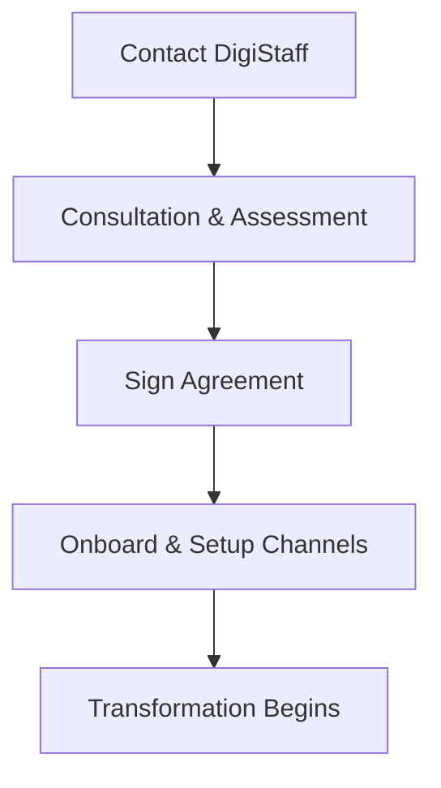

## Prerequisites

Before starting, ensure you have the following ready:

<Callout kind="info">
- A clear understanding of your organization's AI goals
- Key stakeholders identified (e.g., CTO, HR lead, department heads)
- Access to your company calendar for scheduling
- An email address for official communications
</Callout>

Review these to streamline your engagement with DigiStaff's AI transformation consulting.

## Quickstart Process

Follow these steps to go from initial contact to fully onboarded.

<Steps>
  <Step title="Schedule Your First Consultation" icon="calendar">
    Contact DigiStaff to book a 30-minute discovery call. Choose your preferred method below.

    <Tabs>
      <Tab title="Email" icon="mail">
        Send an email to `consultations@digistaff.com` with your availability.
      </Tab>
      <Tab title="Calendar Link" icon="calendar">
        Use this direct booking link: [Book Now](https://calendly.com/digistaff/consultation).
      </Tab>
      <Tab title="Phone" icon="phone">
        Call `+1-555-DIGI-STAFF` during business hours (9 AM - 6 PM EST).
      </Tab>
    </Tabs>

    Prepare a brief overview of your AI objectives.
  </Step>

  <Step title="Assess AI Readiness" icon="bar-chart">
    During the call, DigiStaff guides you through a quick assessment. Rate your organization across key areas:

    | Area              | Readiness Level | Notes Example                  |
    |-------------------|-----------------|-------------------------------|
    | AI Strategy       | Low/Med/High    | No current roadmap            |
    | Employee Fluency  | Low/Med/High    | Basic awareness training done |
    | Technical Infra   | Low/Med/High    | Cloud-ready but no AI tools   |
    | Change Management | Low/Med/High    | Recent org changes successful |

    Download the [AI Readiness Checklist](/introduction#readiness-checklist) for self-assessment beforehand.
  </Step>

  <Step title="Onboarding Process" icon="check-circle">
    Once approved, sign the engagement agreement via DocuSign. DigiStaff provides:

    - Customized AI transformation roadmap
    - Initial training schedule
    - Dedicated account manager

    Expect onboarding within `>48 hours` of agreement.
  </Step>

  <Step title="Set Up Communication Channels" icon="messages-square">
    Establish secure channels for ongoing collaboration.

    <CodeGroup tabs="Slack,Microsoft Teams,Email">
      ````bash
      # Slack Workspace Invite (run in terminal if automating)
      curl -X POST https://slack.com/api/usergroups.users.invite \
        -H "Authorization: Bearer YOUR_SLACK_TOKEN" \
        -d "channel=digistaff-project" \
        -d "users=your-team@company.com"
      ````

      ````powershell
      # Microsoft Teams (PowerShell example)
      Install-Module MicrosoftTeams
      Connect-MicrosoftTeams
      New-Team -DisplayName "DigiStaff Project" -Visibility Private
      ````

      ````markdown
      # Email Template
      Subject: DigiStaff Project Update

      Team,
      Latest on AI fluency training...
      ```
      ````
    </CodeGroup>
  </Step>
</Steps>

## Next Steps

<Columns cols={3}>
  <Card title="AI Fluency Training" icon="book-open" href="/introduction">
    Build foundational AI skills for your team.
  </Card>
  <Card title="Implementation Strategy" icon="zap" href="#strategy">
    Develop your custom roadmap.
  </Card>
  <Card title="Ongoing Optimization" icon="trending-up" href="/changelog">
    Monitor and refine your transformation.
  </Card>
</Columns>

<Callout kind="tip">
  Stuck? Reach out to your account manager or join our community Slack for peer support.
</Callout>



Your journey to AI transformation starts now. Complete these steps to unlock DigiStaff's full potential.