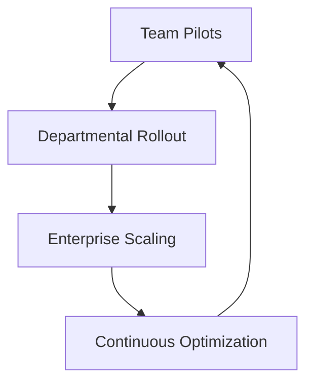

## Overview

DigiStaff guides your organization through a structured AI transformation process focused on sustained success. After initial implementation, you enter the critical phase of ongoing monitoring, optimization, scaling, and ROI measurement. This ensures AI initiatives deliver continuous value, adapting to evolving business needs and performance data.

The process emphasizes proactive oversight, iterative improvements, and scalable adoption across teams. You track key performance indicators (KPIs), refine models, expand usage organization-wide, and quantify returns to justify investments.

<Callout kind="info">
  Engage DigiStaff early in monitoring to avoid common pitfalls like model drift or underutilized AI tools.
</Callout>

## Ongoing Monitoring

Establish continuous monitoring to detect issues early and maintain AI reliability. You implement dashboards and alerts to track model performance, data quality, and usage patterns.

<Steps>
  <Step title="Set Up Dashboards" icon="activity">
    Connect your AI models to a monitoring dashboard like `https://dashboard.example.com`.

    ```bash
    npm install @digistaff/monitor-sdk
    ```
  </Step>
  <Step title="Define Alerts" icon="bell">
    Configure thresholds for accuracy drops `<90%` or latency `>500ms`.
  </Step>
  <Step title="Review Logs" icon="file-text">
    Schedule weekly reviews of error logs and anomaly reports.
  </Step>
</Steps>

## Optimization Strategies

Optimization refines AI performance through targeted adjustments. Use these strategies based on your priorities.

<Tabs>
  <Tab title="Performance Tuning" icon="zap">
    Fine-tune hyperparameters and retrain models with fresh data.

    <CodeGroup tabs="Python,JavaScript">
      ```python
      from sklearn.model_selection import GridSearchCV
      param_grid = {'n_estimators': [100, 200], 'max_depth': [10, 20]}
      grid_search = GridSearchCV(estimator, param_grid, cv=5)
      grid_search.fit(X_train, y_train)
      print(grid_search.best_params_)
      ```
      ```javascript
      const ml5 = require('ml5');
      const options = { task: 'regression', debug: true };
      const model = ml5.neuralNetwork(options);
      model.normalizeData(trainingData);
      await model.train(trainingData, { epochs: 200 });
      ```
    </CodeGroup>
  </Tab>
  <Tab title="Cost Reduction" icon="dollar-sign">
    Prune models and shift to efficient inference endpoints to lower compute costs.
  </Tab>
</Tabs>

## Scaling Across Levels

Scale AI from pilot projects to enterprise-wide adoption by aligning with organizational structure.

<Columns cols={3}>
  <Card title="Team Level" icon="users" href="#team-scaling">
    Deploy AI tools for specific departments, measuring team productivity gains.
  </Card>
  <Card title="Departmental" icon="building-2" href="#dept-scaling">
    Integrate across functions like sales and operations for cross-team efficiency.
  </Card>
  <Card title="Enterprise" icon="globe" href="#enterprise-scaling">
    Standardize governance and infrastructure for organization-wide rollout.
  </Card>
</Columns>



## Measuring ROI and Success Metrics

Quantify impact with clear metrics. Track cost savings, revenue uplift, and efficiency gains.

| Metric | Description | Target |
|--------|-------------|--------|
| ROI | (Gain from Investment - Cost) / Cost × 100 | `>200%` |
| Model Accuracy | Prediction correctness rate | `>95%` |
| Time Savings | Hours reduced per task | `>30%` |
| Adoption Rate | % of users actively using AI | `>70%` |

<Expandable title="Advanced ROI Calculation" default-open="false">
  Compute ROI programmatically for precise tracking.

  <CodeGroup tabs="Python,JavaScript">
    ```python
    def calculate_roi(investment_cost, gains):
        return ((gains - investment_cost) / investment_cost) * 100

    roi = calculate_roi(50000, 200000)
    print(f"ROI: {roi:.2f}%")
    ```
    ```javascript
    function calculateROI(investment, gains) {
      return ((gains - investment) / investment) * 100;
    }
    const roi = calculateROI(50000, 200000);
    console.log(`ROI: ${roi.toFixed(2)}%`);
    ```
  </CodeGroup>
</Expandable>

<Callout kind="tip">
  Review metrics quarterly with DigiStaff to align optimizations with business goals and celebrate milestones.
</Callout>